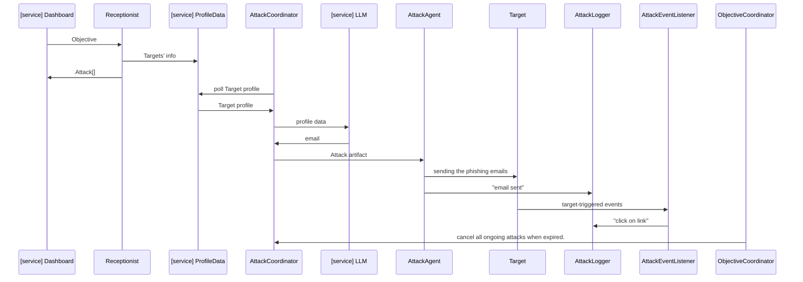

# attack-service

## Authentication

- Authorization entry in the header: `Authorization: Api-Key <API_KEY>`.

## Schema

- Go to server URL or start one locally with `python manage.py runserver`
- go to `/schema/swagger-ui/`

## Errors and API calls

The code base is setup in a way that all exceptions happening during an API
call will always follow the same schema (see `schema/swagger-ui/`). They will always
have the form of

```json
{
  "message": "A human readable message without sensitive data, can be exposed to the user.",
  "data": {},
  "category": "High level category of the error.",
  "error_code": "Specific error code."
}
```

### Read the swagger docs

Head to `/schema/swagger-ui/` to know which payloads to expect from an endpoint. The swagger docs
provide both schema definition and examples.


### Implementation

Modules of interest:

- `app/middleware.py`
- `core/errors.py`
- `core/serializers.py`

A middleware in `app/middleware.py` intercepts all outgoing exceptions and makes sure the schema is
followed.

For all errors in `core/errors.py` (descendants of `ApplicationError`), the `VALIDATION_ERROR` and
the generic `ERROR`, serializers and example payloads are programmatically generated in
`core/serializers.py`. If your new error is a descendant of `ApplicationError` you don't need to do
anything. These serializers are divided in categories (`db_error_serializers`,
`llm_service_provider_error_serializers` ...) for ease of use in the api module. Example payloads
can be used to generate `OpenApiExample`s, like it happens in the api module.

## Running locally and development

> **Tip:** Before starting local development, it's advised to set up
> a virtual environment for Python. We recommend using miniconda
> `conda create --name yolo python=3.9.15` then `conda activate yolo`

Gitflow, i.e. merge stuff to `dev` then merge to master to trigger a
release.

- install dependencies (`pip install -r requirements.txt && pip install -r requirements.dev.txt`)
- `pre-commit install`
- Enable `flake8`, `black` and `pylint` in your IDE.
- Copy `.env-template` to a `.env`, and fill in the details from 1password
- Start a container for a local db

  ```bash
  docker-compose up
  ```

- if it's the first time you are starting the db, you have no state (see the -v in the
  previous command)
- `python manage.py migrate`
- `python manage.py createsuperuser`
- `python manage.py runserver`
- Login at `http://127.0.0.1:8000/admin/`
- Create an API key in the admin panel if you need to use the API
- API schema at `http://127.0.0.1:8000/schema/swagger-ui/`

### Experimentation through notebooks and repls

```bash
python manage.py shell_plus --help
python manage.py shell_plus --notebook
python manage.py shell_plus --ipython
```

Then import and use application logic as needed. When running a notebook, you
can pick up codebase changes by restarting the kernel. Example of a notebook

```python
from core.text_generation.emails import generate_email_with_llm
from core import types
subject, body = generate_email_with_llm()
```

### Running tests

Use `python manage.py test` to run the unit test.
Django creates a test database for running the unit tests; no extra config is needed.

## Heroku application setup

Buildpacks:

- heroku buildpacks:add heroku/python
- add papertrail and a postgres database addons

## Sequence diagram


